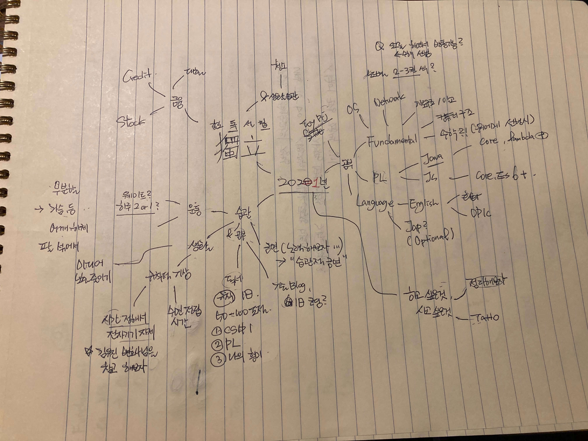

### 취준 활동
21년 2월 1일 회사에 첫 출근을 했다. 작년 12월 말부터 준비를 해서 이력서를 쓰고 넣고 하면서 많은 생각이 들었던거 같은데;;
시간은 어떻게든 흐른다. 어쨌든 나는 이전에 17년~ 18년 정도 1년 정도의 경력을 갖고 있다. 
하지만 여러 사정이 겹쳐 3년에 가까운 기간 동안의 경력 공백이 생겼었는데, 그 동안 혼자 공부도 해보고 토이 프로젝트도
해 보았지만.. (학창 시절 수학은 집합 공부를 제일 열심히 하였듯 - 남은 결과물은 없다.)
인터뷰에 떨어져 낙담도 해보고 '아 내가 안일하게 살았구나' 하고 자책도 하면서 살다가
계속 비비다 보니 운이 좋게도 내가 생각했던 연봉보다 조금 더 받고 들어왔다.

### 1달간의 생활중 느낀점
#### 마인드셋
난 걱정이 많은 사람이다. 그중 가장 쓸 곳이 없는 일어나지 않은 일에 대한 불안감을 많이 갖고있는.
다른 <code>INFP</code> 사람들도 나랑 비슷한 사람들일까? 첫주에는 업무가 눈에 들어오지 않고 도망가고 싶다는 
애새끼마인드가 내 몸을 감쌌다. 그래도 뭐 회사도 사람들이 사는 곳이라 여차저차 시간이 해결해주는
것 같다. 
사람들도 좋다. 남들보다 조금 더 일찍 가고, 조금 더 인사를 잘하자는 마인드

#### 자기개발
1. 운동을 출근 전에도 해보고, 퇴근후에도 해보았다. 출근전은 몸이 피곤하고 퇴근 후는 사람이 너무 많고
이전에 운동했던 곳은 토끼가 다니는 초원이었다면, 저녁 시간의 헬스장은 던전이다. 베스트는 출근 전인데
운동하고 출근하면 하루가 아직 멍하더라. 그래도 다음달은 아침때 최대한 가보려고 노력할 예정
2. 출, 퇴근이 1시간 거리인데 하고 집에오면 뭐 한게 없는데도 하루를 마무리 해야된다. 이번 달에는
> 허지웅님의 살고 싶다는 농담  
> 성공과 실패를 결정하는 1% 의 네트워크 원리 (50%) 

정도를 출퇴근
버스에서 읽었다. 일반 책들은 술술 넘기는데 네트워크 책은 어느 순간부터 읽는데 속도가 걸리면서 
훌륭한 수면보조제가 되었다 (...) 다른 방법을 찾아서 시도해봐야 겠다.

3. 이 외에 집안일도 해야 되고, 토이프로젝트도 해야 되고, 공부도 해야되고, 머리 속이 복잡하다🤦‍♂️
친구는 안만나니? 

### 앞으로 뭘 해야 할까?

1. 올 해 해보고 싶었던걸 언제 적었더라. 작년 12월인가 올 1월인가 쭉 한번 적어봤는데
우선 가장 먼저 하고 싶은 것은 <code>주거적 독립</code>을 준비하려 한다.
2. 그리고 재테크보다는 나의 <code>Fundamental</code>을 챙기고 싶다. 음.. 근데 지금 이렇게 보니까 
저기서 몇개는 못 지킬게 많이 보인다. 그렇다. 계획은 밤에 세우면 안된다.
3. 이 글을 다시 한번 돌아보면서 쓸 날을 기다리며 포스팅을 마친다. ✍