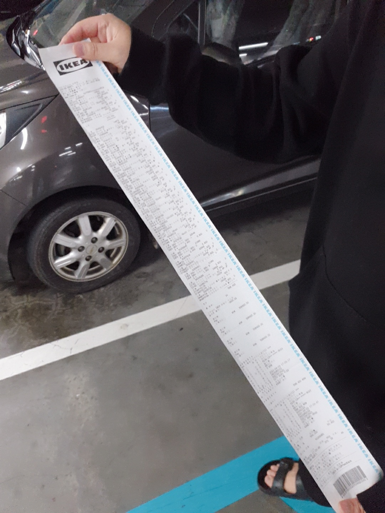
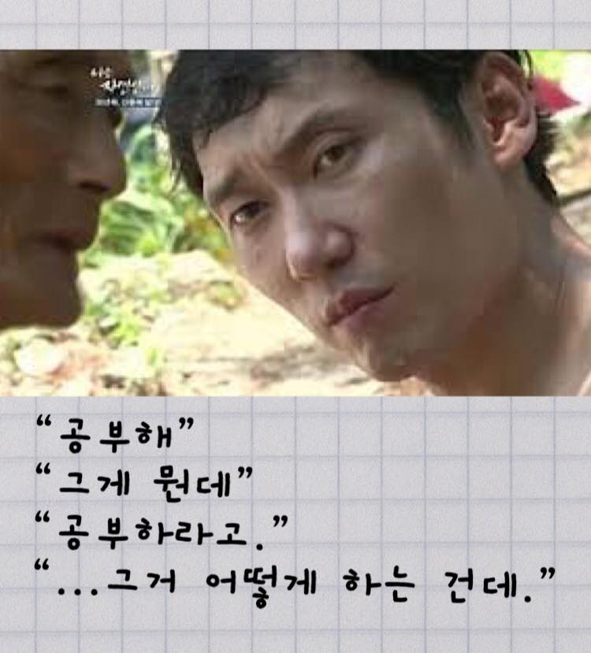

### 독립
정신없이 2달이 지났다. 봄은 뭐했는지 모르겠고 곧바로 여름이 다가온다. 최근 한 달 
주말동안 계속 비가오더니만 덥고 춥고 중간이 없다. 올 해 최대의 목표였던 독립을 했다.
방 한칸 5평짜리 원 룸이지만, 스무살 때 부터 생각해 왔었기에 아쉬움은 남지 않는다.

#### 방 보러 다니기
집 계약을 먼저하고 가심사 - 본 대출 <code>중기청 전세자금대출</code>을 실시해서 받았다. 작년에 8천에 봤던 빌라가 더 넓고
했겠지만.. 멀었고(강서사거리) 참 ㅠㅠ.. 나름 큰 돈을 들여서 하는 거라 생각했는데
전세 매물이 없었다. 퇴근하고 방을 보러 다니며 조금이나마 넓다 생각해서 바로 계약했는데 한 달 동안
살아보니 햇볕이 안든다 (...) 다음에는 꼭, 볕 잘드는 투룸으로 옮기리라.

#### 카드 값
이사하면서 생각한 비용이 있지만, 막상 결제일이오니까 눈물이 다나네 ㅠㅠ. 처음 집 나온다고
이케아 갔더니 눈돌아가서 이것저것 집었다. 이걸 보는사람이 있겠냐마는 있다면 완제품 사라.
이사하고 일주일동안 퇴근하고 조립만했다. 영수증보고 놀랬더니 캐셔 으즈므니께선
이정도면 최약체 수준이라고 얘기해주셨다. 우리나라 경제 살아있구나 ..

#### 자기개발
1. 두달동안 운동을 등한시하고, 헬스장 직원의 품위유지비에 일조를 하였다.
나 같은 회원들이 모여서 헬스장의 월세를 내지 않을까? 우선 변명을 하자면 ..
이사를 하느라 정신이 없었고, 튜토리얼을 마친 나에게 그 헬스장은 던전이었다.
그리고 술맛이 맛있더라.. 

2. 헬수장을 옮겨서 해볼라구 한다. 목표는 주 3회로 잡자...

3. 공부? 그게뭔데.. 어떻게 하는건데 .. 

기선님의 지나간 자바 블로깅을 하면서 겸사겸사 유데미 들을 예정.

### 앞으로는

1. 이렇게 유지 해보고, 하나씩 해보자.
2. 다음 글을 쓸 때를 기다리며 포스팅을 마친다. ✍